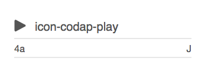
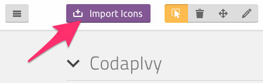

# codap-ivy-icons
This is a repository for the shared web icon fonts for [Codap](https://github.com/concord-consortium/codap),
and the
[Building Models](https://github.com/concord-consortium/building-models)
projects of the [Concord Consortium](http://concord.org/).

See how the fonts look, and what their CSS class names are at the
[github pages site](https://concord-consortium.github.io/codap-ivy-icons/)

### Using the fonts

1. You have to reference the stylesheet from your document head like this:

        <head>
         …
         <link rel="stylesheet" href="CodapIvy/codap-ivy-fonts.css">
         …
        </head>

2. Use `<i>` tags with the approriate css selectors where you want your icons.
For example if we wanted to use the above `icon-codap-play` triangle, we would
use this markup: `<i class='icon-codap-play'/>`

## Updating the fonts & css in this project:

1. Visit [icomoon](https://icomoon.io)
2. Import the project by uploading `CodapIvy/selection.json`
3. Select all the icons.
4. Click on the *Generate Font F* button at the bottom right.
5. Click on the *Download* button at the bottom right.
6. Unpack the zipfile *CodapIvy.zip*
7. Move the folder in to this repo, replacing the existing `CodapIvy` folder.
8. Open `CodapIvy/demo.html` file in your browser, to check that it looks good.
9. Push your code to github
10. Update the Staging demo site by running `./build.sh`

## TODO
* Instructions for deploying to S3 and Cloudfront
